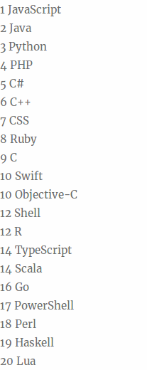
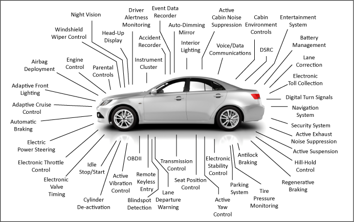
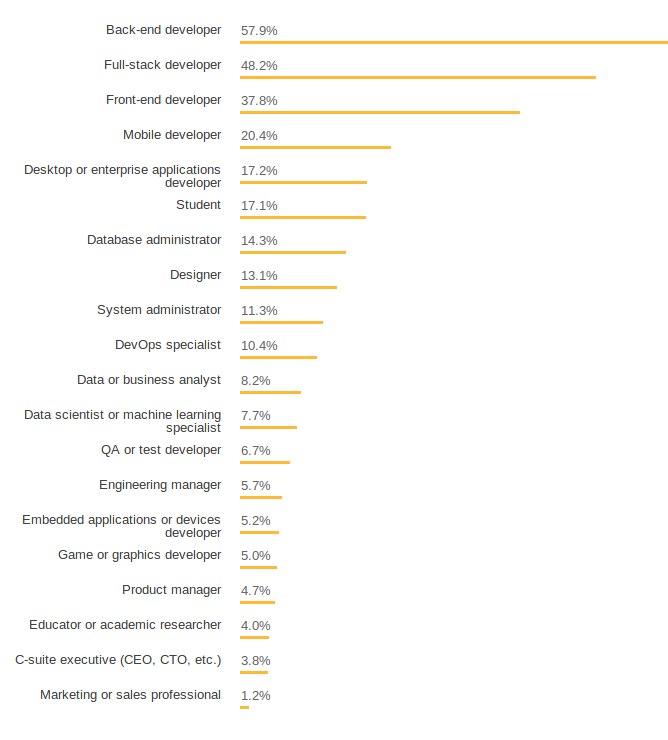
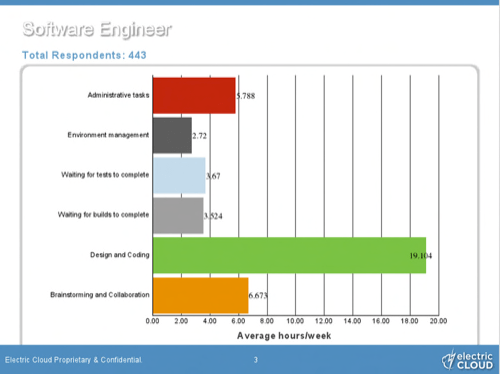

# A szoftverfejlesztés világa

## Mi az a szoftver?

#### Számítógép / hardver


#### Szoftver

Az informatikában forráskódon (angolul: source code) egy olyan szöveg értendő, ami egy leíró nyelv jelöléseinek, vagy egy programozási nyelv definícióinak és/vagy utasításainak sorozatát tartalmazza.


Népszerűség szerinti sorrend a redmonkról:
http://redmonk.com/sogrady/2018/03/07/language-rankings-1-18/



```scala
// Scala
def add(x: Int, y: Int) = x + y

add(5, 7)
```

```clojure
; Clojure
(defn add [x y] (+ x y))

(add 5 7)
```

```java
// Java
private static int add(int x, int y) {
    return x + y;
}

add(5, 7);
```

```python
# Python
def add(x, y):
    return x + y

add(5, 7)
```

```haskell
-- Haskell
add :: Integer -> Integer -> Integer
add x y =  x + y

add 5 7
```

## Hol használnak számítógépeket?
_Kb mindenhol_

Telefonok, Internet, autók, repülők, orvosi műszerek, bankok, háztartási eszközök, gyárak automatizálása, robotok, stb...



Vagy építhetsz egy robotot, ami a szemedbe világít...


## Szakterületek

Akik kódolnak:
* Back-end developer
* Full-stack developer
* Front-end developer
* Mobile developer
* Operations specialist
* Data Scientist
* Test engineer
* Embedded developer
* Game/Graphics developer

Akik nem nagyon kódolnak:
* Manager
* Business Analyst
* Marketing/Sales professional




## Egy átlagos nap



Sok a flexibilis munkaidős állás. Járhatsz 10-re vagy 11-re, (vagy reggel 7-re).


## Továbbtanulás
A legközelebbi egyetemi képzések a mérnökinformatika, programtervező informatikus és hasonlók. De sokan lesznek szoftverfejlesztők más szakokról is, pl: villamosmérnöki, matek, fizika, gépészmérnöki, stb..

### Lehetőségek
* Bsc, Egyetem
    * Nem akarsz még dolgozni, nem tudod pontosan, hogy ez érdekel-e
    * Sok mindenhez kapsz elméleti alapot, amit bootcampeken nem oktatnak (Matek, számítástudomány, stb.)
    * Itt is lesznek fölösleges tárgyak

* Bootcamp
    * Gyorsabban végzel és mehetsz pénzt keresni
    * Sok mindent lehet tanulni munka közben, amit egyetemen nem
    * Amit itt nem oktatnak, de egyetemen igen és fontos, azt érdemes megtanulni magadtól később

* Msc, Egyetem
    * Bsc-vel nagyon jól el lehet helyezkedni, az esetek többségében nem indokolt, és fizetésben sem feltétlenül jársz jobban

* Self-taught 
    * Csak ha pontosan tudod, hogy mit szeretnél megtanulni
    

### Mihez érdemes érteni
* Angol
* Google